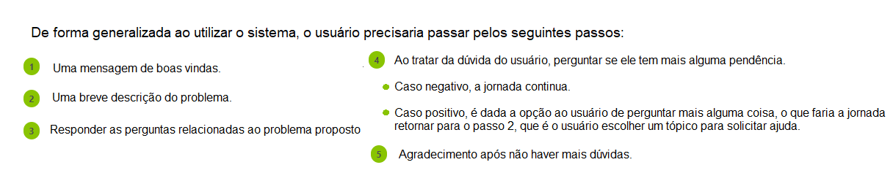

# infoAdotar

**Felipe Lacerda Tertuliano, felipeltertuliano@gmail.com**

**João Marcos de Oliveira Magalhães, jmarcosomjm@gmail.com**

**Leonardo Miguel Valle Mourão, leo.mvm@hotmail.com**

**Vitor Cabral Rodrigues Pires, vitorcrp@hotmal.com.br**

---

_Curso de Ciência da Computação, Unidade Coração Eucarístico_

_Instituto de Informática e Ciências Exatas – Pontifícia Universidade de Minas Gerais (PUC MINAS), Belo Horizonte – MG – Brasil_

---

Com o avançar dos anos, a adoção ganhou destaque no cenário nacional. Em 1990, a prática da adoção foi regulamentada com o Estatuto da Criança e do Adolescente (ECA) e, desde então, o número de pessoas na fila para adotar cresce gradativamente. Entretanto, muitas pessoas identificam dificuldades para iniciar esse processo, no que diz respeito,  à falta de conhecimento e informação acerca do procedimento adotivo. Portanto, o presente trabalho visa auxiliar futuros pais e mães que pretendem adotar à sanar dúvidas sobre o processo de perfilhamento, permitindo que estejam em um meio ambiente com informações relevantes para assisti-los. 

---

**1. Introdução**

Na **contextualização**, o aluno deve dizer do que se trata o trabalho, em que área ou contexto se insere. 
A **contextualização** deve ser desenvolvida de algo mais genérico para algo mais específico. 
A citação de pesquisas quantitativas é bem aceita aqui (corretamente referenciadas).

Em seguida o aluno deve caminhar a contextualização para descrever o **problema** que o artigo trata. 
O **problema** pode ser algo vivido em uma empresa específica. 

    1.1 Contextualização
    1.2 Problema
O processo de regularizar os documentos, entrar no CNA (Cadastro Nacional de Adoção) e formalizar a adoção é árduo e demanda um tempo excessivo. Ou seja, com a burocracia e a ineficácia da implementação do sistema brasileiro de adoção, o processo adotivo faz com que os futuros pais e mães adotivos sejam forçados a esperar mais tempo do que deveria para conseguir adotar uma criança, além de sofrerem com a falta de informação e orientação fornecidas a esses pretendentes.

Assim, devido à má implementação desse sistema, ao seu excessivo tempo de espera, à legislação precária envolvida e a muitos outros fatores, os cônjuges que têm a intenção de adotar sofrem com a morosidade do sistema proposto pelo governo do Brasil.

    1.3 Objetivo geral

Auxiliar os futuros pais e mães adotivos a gerenciarem o seu processo de adoção, permitindo que esse procedimento possa se dar de maneira mais simplificada.
		
    1.3.1 Objetivos específicos

* Criar uma plataforma online que estabeleça uma conexão entre os pretendentes, disponibilizando para eles informações acerca do processo adotivo, bem como uma área de comunicação dedicada às perguntas.

* Possibilitar uma maior interação entre os pretendentes por meio de uma comunidade organizada e colaborativa, proporcionando uma relação amigável e recíproca entre os pretendentes.
 

	1.4 Justificativas

A motivação da nossa solução é ajudar todos aqueles que desejam adotar uma criança, mas, por conta da burocracia, da rudimentaridade e da ineficácia do processo adotivo no Brasil, motivos que fazem com tais indivíduos tenham de lidar com a falta de informação, deixando-os sem orientação em um procedimento tão importante para suas vidas. 

**2. Projeto da Solução**

    2.1. Requisitos funcionais

| Id            | Descrição                                                                                                    | Prioridade |
| ------------- |:------------------------------------------------------------------------------------------------------------:| ----------:|
| 01            | O usuário deve conseguir criar uma conta e logar no sistema                                                  |   Alta     |
| 02            | O usuário deve ter uma checklist para gerenciar seu passos na adoção                                         |   Alta     |
| 03            | O usuário deve ter acesso às perguntas frequentes (FAQ)                                                      |   Alta     |
| 04            | O usuário deve conseguir visualizar posts de usuários                                                        |   Alta     |
| 05            | O usuário deve conseguir escrever posts                                                                      |   Média    |

    2.2. Tecnologias

<!--  -->

* Linguagens de desenvolvimento front-end:
    * HTML5
    * CSS em conjunto com a framework Bootstrap
    * JavaScript
* Linguagem de desenvolvimento back-end:
    * Java (com a framework Spark Java)
* Base de dados:
    * PostgreSQL
* IDEs:
    * Microsoft Visual Studio Code
    * Eclipse IDE
 

	2.3. Serviços inteligentes

O sistema do infoadotar conta com serviços inteligentes de chatbot de informações, no qual responde à perguntas definidas em um conjunto de conhecimentos utilizando os Serviços Cognitivos da plataforma Blip, a fim de enriquecer a experiência do usuario, melhorar a performance do projeto e possibilitar com que os usuarios sanem suas dúvidas de forma rápida e prática.

##### Estrutura do Chatbot: 

##### Informações sobre o fluxo:

	
**3. Modelagem de dados**

O infoAdotar possui, em seu banco de dados, 4 relações:
* Usuário
* Postagem
* Avaliação da postagem
* Pergunta do FAQ

##### O usuário contém os dados necessários para sua autenticação no sistema, que são:
* Nome completo
* Email
* Senha
##### A postagem contém:
* Id para sua identificação
* Email do usuário que a criou
* Id da postagem a qual ela responde, se for o caso
* Conteúdo da postagem
##### A avaliação da postagem contém:
* O email do usuário que a criou
* O id identificador da postagem
* A nota da avaliação
##### A pergunta do FAQ contém:
* Id para sua identificação
* O título da pergunta
* A resposta da pergunta
 

    3.1. Diagrama de Entidade-Relacionamento

**4. Sistema desenvolvido**

O sistema do infoAdotar conta com 3 páginas web, sendo elas:
* Página de landing, pela qual o usuário chega no sistema
* Página de login e cadastro, que permite ao usuário utilizar suas credenciais no sistema
* Página principal, a qual contém os recursos da plataforma disponíveis

## Página de Landing

Página inicial do site do infoAdotar.

## Página de login e de cadastro

Permite ao usuário criar uma conta no infoAdotar ou entrar com sua conta existente no sistema.

 

## Tela home

Painel principal do infoAdotar, onde o usuário controla os recursos do sistema. Estes são:
1. Card que contém um resumo das atividades do usuário no sistema
2. Card contendo as postagens da comunidade
3. Card que dá acesso ao FAQ

## FAQ

Este componente dará acesso a um conjunto de perguntas frequentemente realizadas ao usuário.
O usuário terá a possibilidade de pesquisar por uma dúvida em específico.

**5. Avaliação**

Faça aqui sobre a avaliação do software. Indique se ele atendeu as expectativas e ele é viável. 
Para não ficar subjetivo, o ideal é fazer um questionário e pedir ao usuário do processo que faça a avaliação.

**6. Conclusão**

Apresente aqui a conclusão do seu trabalho. Discussão dos resultados obtidos no trabalho, onde se verifica as 
observações pessoais de cada aluno. Poderá também apresentar sugestões de novas linhas de estudo.  

**REFERÊNCIAS**

**[1.1]** - _ELMASRI, Ramez; NAVATHE, Sham. **Sistemas de banco de dados**. 7. ed. São Paulo: Pearson, c2019. E-book. ISBN 9788543025001._

**[1.2]** - _COPPIN, Ben. **Inteligência artificial**. Rio de Janeiro, RJ: LTC, c2010. E-book. ISBN 978-85-216-2936-8._

**[1.3]** - _CORMEN, Thomas H. et al. **Algoritmos: teoria e prática**. Rio de Janeiro, RJ: Elsevier, Campus, c2012. xvi, 926 p. ISBN 9788535236996._

**[1.4]** - _SUTHERLAND, Jeffrey Victor. **Scrum: a arte de fazer o dobro do trabalho na metade do tempo**. 2. ed. rev. São Paulo, SP: Leya, 2016. 236, [4] p. ISBN 9788544104514._

**[1.5]** - _RUSSELL, Stuart J.; NORVIG, Peter. **Inteligência artificial**. Rio de Janeiro: Elsevier, c2013. xxi, 988 p. ISBN 9788535237016._
